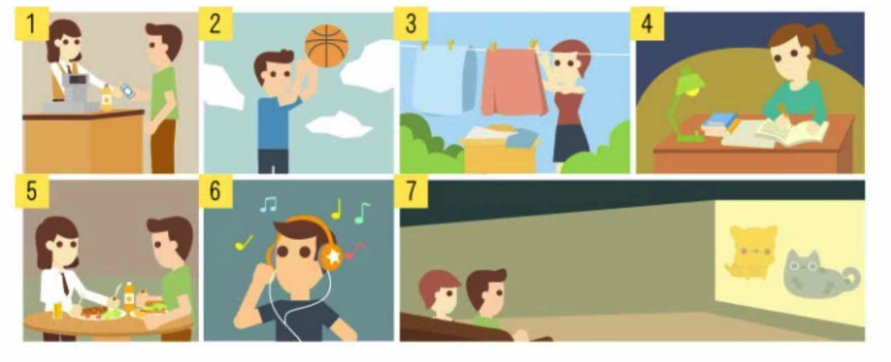

第35回：第7課浦東（5）
===

[TOC]

上一课复习
---

1. 语法三：格助词「と」表示动作的对手、对象

2. 语法四：格助词「で」表示范围、动作作用的状态或条件

3. 语法五：格助词「に」表示动作、作用的目的地、着落点、对象

4. 语法六：「疑问词＋か」表示不确定

5. 语法七：形容词的否定式：形容词词尾い变く＋ありません

6. 语法八：形容动词的否定式：形容动词词干＋ではありません

7. 钞票的数法

    | 漢字 | 読み方           | 漢字 | 読み方     |
    | ---- | ---------------- | ---- | ---------- |
    | 一円 | いちえん         | 六円 | ろくえん   |
    | 二円 | にえん           | 七円 | ななえん   |
    | 三円 | さんえん         | 八円 | はちえん   |
    | 四円 | よえん／よんえん | 九円 | きゅうえん |
    | 五円 | ごえん           | 十円 | じゅうえん |

8. 星期的说法

    | 漢字   | 読み方     |
    | ------ | ---------- |
    | 月曜日 | げつようび |
    | 火曜日 | かようび   |
    | 水曜日 | すいようび |
    | 木曜日 | もくようび |
    | 金曜日 | きんようび |
    | 土曜日 | どようび   |
    | 日曜日 | にちようび |

课后练习
---

### 二、填入适当的助词

1. きのうどこ（か）へ出かけましたか。
2. 留学生の木村さん（と）いっしょに買い物をしました。
3. この店は淮海路（で）一番大きいです。
4. そこの品物はあまり安（くありません）。
5. 李さんと二人（で）食事をしました。
6. 学校の近くの公園はきれい（ではありません）。
7. 飛行機は何時に上海（に）着きますか。

### 三、仿照例句改换讲法

（1）例：食事のあと散歩します。→食事のあと散歩しました。

1. 食事のあと木村さんとお茶を飲みます。→食事のあと木村さんとお茶を飲みました。
2. 二人は近くのレストランで昼食を取ります。→二人は近くのレストランで昼食を取りました。
3. 公園でたくさんの写真を撮ります。→公園でたくさんの写真を撮りました。
4. 日曜日に日帰り旅行をします。→日曜日に日帰り旅行をしました。
5. 駅で切符を買います。→駅で切符を買いました。

（2）例：国際ホテルは高いです。→国際木テルは高くありません。

1. 駅は近いです。→駅は近くありません。
2. 肉まんじゅうはおいしいです。→肉まんじゅうはおいしくありません。
3. この映画はおもしろいです。→この映画はおもしろくありません。
4. これはめずらしいです。→これはめずらしくありません。
5. 旅行は楽しいです。→旅行は楽しくありません。

（3）例：公園はきれいです。→公園はきれいではありません。

1. このホテルは有名です。→このホテルは有名ではありません。
2. ここはにぎやかです。→ここはにぎやかではありません。
3. 図書館の建物はりっぱです。→りっぱではありません。
4. ここは便利です。→便利ではありません。
5. 生活は楽です。→生活は楽ではありません。

（4）例：第一ヤオハンデパートは一番大きいデパートです。（このあたり）→第一ヤオハンデパートはこのあたりで一番大きいデパートです。

1. 李さんの日本語は一番上手です。（クラス）→李さんの日本語はクラスで一番上手です。
2. このホテルは一番高いです。（上海）→このホテルは上海で一番高いです。
3. この部屋は一番きれいです。（学生寮）→この部屋は学生寮で一番きれいです。
4. わたしの家は一番遠いです。（三人の中）→わたしの家は三人の中で一番遠いです。
5. 日本語は一番下手です。（外国語の中）→日本語は外国語の中で一番下手です。

### 四、仿照例句写出答句。

例：あなたは一人で行きますか。（李さん／二人）→いいえ、李さんと二人で行きます。

1. あなたは一人で復習しましたか。（友達／三人）→いいえ、友達と三人で復習しました。
2. 昨日、呂さんは一人で買い物しましたか。（お母さん／二人）→いいえ、お母さんと二人で買い物をしました。
3. お父さんは一人で食事をしましたか。（わたし／二人）→いいえ、わたしと二人で食事をしました。
4. 一人で出張しますか。（会社の人／三人）→いいえ、会社の人と三人で出張します。
5. 一人で日帰り旅行をしましたか。（クラスの人／四人）→いいえ、クラスの人と四人で行きました。

### 五、请回答下列问题

1. きょうは何曜日ですか。
2. きのうは何曜日でしたか。
3. 昨日はどんな天気でしたか。

> いい天気でした。
> わるい天気でした。
> 量り（くもり）でした。
> 雨でした。
> 雪でした。

4. あなたはよくどこで買い物をしますか。

> スーパー
> コンビ二
> デパート

5. あなたはいつもだれといっしょに買い物をしますか。

> お母さん
> 友達
> 彼氏／彼女
> 一人で

6. その店の品物はいいですか。値段は高いですか。

> いい／悪い
> 高い／安い
> そして／しかし

7. 学校の食堂の料理はおいしいですか。

> おいしい
> おいしくありません
> まあまあです

8. あなたはときどきレストランで食事をしますか。

> よくします
> ときどきします
> あまりしません

9. あなたはよく映画を見ますか。

> よく見ます
> ときどき見ます
> あまり見ません

10. 食事のあと、あなたはよくだれと散歩しますか。どこで散歩しますか。

> お母さん、おばあさん、友達…
> 家の近く、公園、大学のキャンパス、川の近く…

### 六、请将下列汉语译成日语

| 汉语                                                         | 日语                                                         |
| ------------------------------------------------------------ | ------------------------------------------------------------ |
| A：昨天真是好天气啊，你去什么地方了吗？                      | 昨日はほんとうにいい天気でしたね。どこかへ出かけましたか。   |
| B：是的，我出去了。我和小吕两人去朋友家了。                  | はい、でかけました。呂さんと二人で友達の家へ（に）行きました。 |
| A：你朋友家远吗？                                            | その友達の家は遠いですか。                                   |
| B：不远。骑自行车用了十五分钟左右。我们十点左右到那儿的。午饭在朋友家三人一起吃的。 | いいえ、遠くありません。自転車で十五分ぐらいかかりました。私たちは十時ごろそこに着きました。昼食は友達の家で三人でしました（食べました）。 |

| 汉语                                                         | 日语                                                         |
| ------------------------------------------------------------ | ------------------------------------------------------------ |
| A：你经常在哪买东西？                                        | （あなたは）よくどこで買い物をしますか。                     |
| B：我常在学校附近的商店买东西。那店的价格不贵，而且东西也好。昨天我买了肥皂。 | よく学校の近くの店で買い物をします。その店の品物の値段は高くありません。そしてものもいいです。昨日、わたしはせつけんを買いました。 |
| A：多少钱？                                                  | いくらでしたか。                                             |
| B：一元五角。                                                | 一元五角でした。                                             |

### 七、看图说话（日曜日は何をしましたか）

ヒント：買い物をする、バスケットボールをする、服を洗う、勉強する、ご飯を食べる、音楽を聴く、映画を見る
時間：朝、午前、午後、夜
場所：スーパー、家、寮、運動場、食堂、教室、図書館、映画館
時間＋場所＋すること
例：私はあさ、運動場でバスケットボールをしました。
私は午後一時から三時まで図書館で勉強しました。